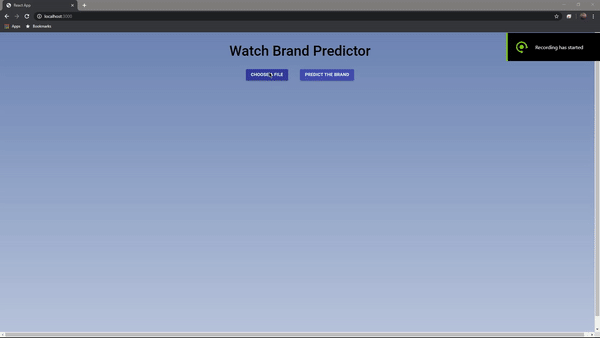

# watch-classifier
Predicts the brand of a watch given an image using a CNN 

At the moment I have not deployed the project because I am having trouble finding a good host with compatibility with the model. However, you can clone the repo, follow the instructions, and get setup locally to try out the model.

## How to Setup Locally
1. Clone the repo
2. Make sure you have Python 3.7+ installed, Node.js, and Node Package Manager (npm, should come with Node.js) installed
3. CD into the repo (root directory), open a terminal, and run "npm install" to install dependencies for React and "pip install -r requirements.txt" to install Python dependencies
4. Once the dependencies are installed, using the terminal and while in the root directory, run "python server.py" to start the local Flask server and "npm start" to launch the React app
5. The project should be setup locally and you can test by uploading a picture to the React page.

## To-Do
- [X] Deploy online
- [ ] Host server and front end on different services rather than render
